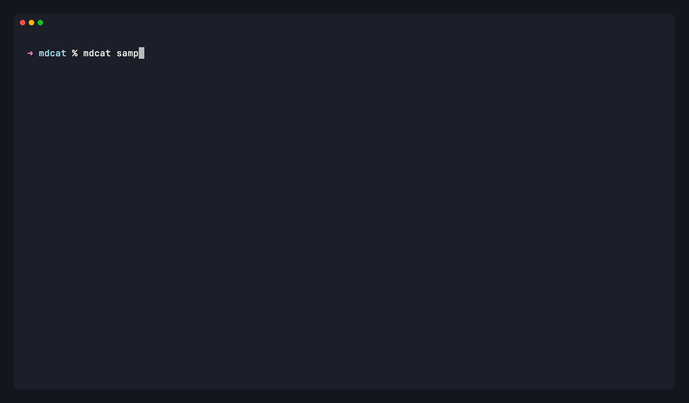

<div align="center">

# mdcat-ng

**Render Markdown in the terminal. Inline images, syntax-highlighted
code, hyperlinks, an interactive viewer.**

[](https://crates.io/crates/mdcat-ng)
[](./LICENSE)
[](https://www.rust-lang.org)

</div>

<p align="center">
  
</p>

---

## What it is

Project provides two binaries. `mdcat` renders a Markdown file
to stdout; `mdless` opens an interactive view over the same output.

Inline images work natively on iTerm2, Kitty, WezTerm, Ghostty,
Rio, VS Code, and Terminology, and via DEC [Sixel] on Foot,
Contour, mlterm, Windows Terminal (1.22+), and `xterm -ti vt340`.
When the terminal can't render an image, links fall back to OSC 8
hyperlinks. Fenced code blocks are highlighted with [syntect].

`mdless` renders the document once, pins the bytes in a buffer,
and scrolls in place. Images are disabled during the rendering.

[Sixel]: https://en.wikipedia.org/wiki/Sixel
[syntect]: https://github.com/trishume/syntect

## Install

Homebrew (macOS, Linux):

```sh
brew tap pawelb0/tap
brew install mdcat-ng
```

Scoop (Windows):

```sh
scoop bucket add pawelb0 https://github.com/pawelb0/scoop-bucket
scoop install mdcat-ng
```

cargo-binstall (prebuilt binary):

```sh
cargo binstall mdcat-ng
```

From source:

```sh
cargo install mdcat-ng
```

Building from source needs `libcurl`: macOS bundles it,
Debian/Ubuntu need `libcurl4-dev`, Fedora `curl-devel`.

Prebuilt tarballs for every release: <https://github.com/pawelb0/mdcat-ng/releases>

## `mdcat`

```sh
mdcat README.md                # render to stdout
curl -sL URL | mdcat -         # from stdin
mdcat file1.md file2.md        # concatenate renders
mdcat --paginate FILE          # pipe through $PAGER / less -r
mdcat --columns 80 FILE        # pin wrap width
mdcat --ansi FILE              # force styling when stdout isn't a TTY
mdcat --detect-terminal        # report the detected terminal + caps
mdcat --theme NAME FILE        # pick color preset (catppuccin, classic, dracula, nord)
```

Full flag list: `mdcat --help` or [`mdcat(1)`](./mdcat.1.adoc).

### Themes

mdcat ships four ANSI color presets: `catppuccin` (default),
`classic` (the mdcat 1.x palette), `dracula`, `nord`. Pick with
`--theme NAME` or set `MDCAT_THEME` in your shell rc. Run
`mdcat --list-themes` to see the names.

mdcat emits ANSI named colors only. Each preset picks slots from
your terminal's 16-color palette; the actual hue comes from your
terminal's color scheme. To restore the previous mdcat 1.x
appearance, run with `--theme classic` or set
`MDCAT_THEME=classic`.

### Piped output

When stdout is a pipe, styling and image escapes drop and the
output is plain text — same convention as `cat`, `grep`, and `ls`.
If you want colour through a pipe, pass `--ansi` or keep `LESS=-R`
in the environment.

### tmux and GNU screen

Set `allow-passthrough on` in the tmux config and image escapes
reach the underlying terminal. Screen triggers the same DCS wrap
automatically from `$STY`.

### Remote images

HTTP images are not fetched by default. Opt in explicitly:

```sh
mdcat --remote-images README.md
```

## `mdless`

Interactive Markdown viewer — vi-style scrolling, live search with
highlight, heading jumps, TOC modal, bookmarks.

### Keys

| Key            | Action                                           |
| -------------- | ------------------------------------------------ |
| `j` / `k`      | Scroll one rendered line down / up               |
| `Space` / `b`  | Page forward / back                              |
| `Ctrl+D` / `U` | Half page forward / back                         |
| `g` / `G`      | Jump to top / bottom                             |
| `NG`           | Jump to rendered line `N` (numeric prefix)       |
| `/PATTERN`     | Forward search (smart-case, literal by default)  |
| `?PATTERN`     | Backward search                                  |
| `n` / `N`      | Next / previous match                            |
| `Esc`          | Clear search highlights                          |
| `]]` / `[[`    | Jump to next / previous heading                  |
| `T`            | Open the TOC modal (`Enter` jumps, `Esc` closes) |
| `m{a-z}`       | Save the current top as bookmark `a`..`z`        |
| `'{a-z}`       | Jump back to a saved bookmark                    |
| `Ctrl+L`       | Force redraw                                     |
| `q` / `Ctrl+C` | Quit                                             |

### Flags

| Flag                | Purpose                                           |
| ------------------- | ------------------------------------------------- |
| `--search PATTERN`  | Commit a query before the event loop starts       |
| `--regex`           | Interpret the pattern as a regex                  |
| `--case-sensitive`  | Disable smart-case; force case-sensitive matching |
| `--external-pager`  | Fall back to `$PAGER` / `less -r`                 |
| `--no-pager` / `-P` | Skip the interactive view and print to stdout     |

## Terminal support

| Terminal           | Styling | Hyperlinks | Images | Notes                          |
| ------------------ | :-----: | :--------: | :----: | ------------------------------ |
| [iTerm2]           |    ✓    |     ✓      | native | Heading jump marks (⇧⌘↑ / ⇧⌘↓) |
| [Kitty]            |    ✓    |     ✓      | native | Kitty graphics protocol        |
| [WezTerm]          |    ✓    |     ✓      | native | Kitty + iTerm2                 |
| [Ghostty]          |    ✓    |     ✓      | native | Kitty protocol                 |
| [Rio]              |    ✓    |     ✓      | native | Kitty protocol                 |
| [VS Code]          |    ✓    |     ✓      | native | iTerm2 protocol                |
| [Terminology]      |    ✓    |     ✓      | native | tycat protocol                 |
| [Foot]             |    ✓    |     ✓      | Sixel  |                                |
| [Windows Terminal] |    ✓    |     ✓      | Sixel  | Since 1.22                     |
| [Contour]          |    ✓    |     ✓      | Sixel  |                                |
| [mlterm]           |    ✓    |            | Sixel  |                                |
| [xterm]            |    ✓    |            | Sixel¹ | `xterm -ti vt340`              |
| [Alacritty]        |    ✓    |     ✓      |        |                                |
| [Konsole]          |    ✓    |     ✓      |        |                                |
| [Warp]             |    ✓    |     ✓      |        |                                |
| [Hyper]            |    ✓    |            |        |                                |
| [Apple Terminal]   |    ✓    | macOS 15+  |        | OSC 8 gated on macOS version   |
| Basic ANSI         |    ✓    |            |        | Strikethrough + OSC 8 required |

1. Detected at runtime via a Primary Device Attributes probe
   unless `--no-probe-terminal` is set. If your terminal advertises
   Sixel but the probe times out, bump the window with
   `--probe-timeout-ms 200`.

SVG images render via [resvg]; its [support matrix][svg] lists the
SVG features that round-trip faithfully.

[iTerm2]: https://www.iterm2.com
[Kitty]: https://sw.kovidgoyal.net/kitty/
[WezTerm]: https://wezfurlong.org/wezterm/
[Ghostty]: https://mitchellh.com/ghostty
[Rio]: https://raphamorim.io/rio/
[VS Code]: https://code.visualstudio.com
[Terminology]: http://terminolo.gy
[Foot]: https://codeberg.org/dnkl/foot
[Windows Terminal]: https://aka.ms/terminal
[Contour]: https://contour-terminal.org
[mlterm]: http://mlterm.sourceforge.net
[xterm]: https://invisible-island.net/xterm/
[Alacritty]: https://alacritty.org
[Konsole]: https://konsole.kde.org
[Warp]: https://www.warp.dev
[Hyper]: https://hyper.is
[Apple Terminal]: https://support.apple.com/guide/terminal/welcome/mac
[resvg]: https://github.com/RazrFalcon/resvg
[svg]: https://github.com/RazrFalcon/resvg#svg-support

## Markdown extensions

Beyond CommonMark:

- Pipe tables, task lists (`- [x]`), strikethrough (`~~text~~`)
- GFM alert blockquotes (`> [!NOTE]`, `> [!TIP]`, `> [!IMPORTANT]`,
  `> [!WARNING]`, `> [!CAUTION]`)
- Smart punctuation (curly quotes, en/em dash, ellipsis)
- Footnotes, definition lists, wiki links (`[[Page]]`,
  `[[Page|label]]`)

Not supported: math (`$inline$`, `$$block$$`), inline markup
inside table cells (plain text only), cell reflow — cells
truncate with `…`.

## Library use

```rust
use mdcat::{
    push_tty, Environment, MarkdownParser, Preset, Settings, SourceParser, TerminalProgram,
};
use syntect::parsing::SyntaxSet;

let markdown = "# Hello\n\nRendered with **mdcat**.\n";
let preset = Preset::default();
let settings = Settings {
    terminal_capabilities: TerminalProgram::Ansi.capabilities(),
    terminal_size: Default::default(),
    multiplexer: mdcat::Multiplexer::None,
    syntax_set: &SyntaxSet::load_defaults_newlines(),
    theme: preset.theme(),
    syntax_color_map: preset.syntax_map(),
    wrap_code: false,
};
let env = Environment::for_local_directory(&std::env::current_dir()?)?;
let handler = mdcat::create_resource_handler(mdcat::args::ResourceAccess::LocalOnly)?;

let mut out = Vec::new();
push_tty(&settings, &env, &handler, &mut out, MarkdownParser.parse(markdown))?;
```

## Packaging

A `cargo install` gives you both binaries. Package metadata:

- Manpage: `asciidoctor -b manpage -a reproducible mdcat.1.adoc`.
  Symlink `mdless.1` to the same manpage.
- Shell completions: `mdcat --completions {bash,zsh,fish}`,
  same for `mdless`.

## Troubleshooting

`MDCAT_LOG=trace` turns on full trace logging; scope it with
`MDCAT_LOG=mdcat::render=trace` for a single module. Logs go to
stderr.

`mdcat --detect-terminal` prints the detected terminal, the
multiplexer (if any), and whatever the DA1 probe discovered — the
first thing to check if an image protocol isn't firing where you
expect it to.

## Contributing

See [CONTRIBUTING.md](./CONTRIBUTING.md). The short version is
`cargo fmt --check && cargo clippy --all-targets --all-features
-- -D warnings && cargo test --all-targets` before you open a PR.

## Licence

MPL-2.0, with a handful of files dual-licensed Apache-2.0. File
headers mark the applicable licence. See [LICENSE](./LICENSE) and
the [CHANGELOG](./CHANGELOG.md) for release history.

## Acknowledgements

Based on [swsnr/mdcat].

[swsnr/mdcat]: https://github.com/swsnr/mdcat
